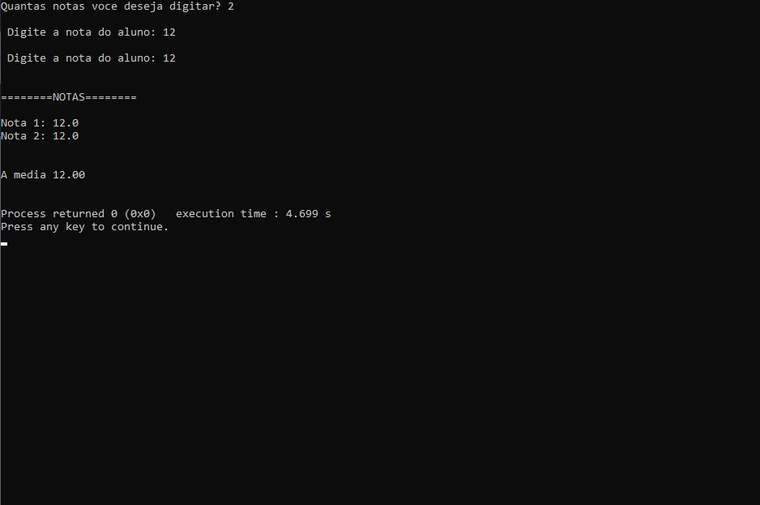

# 28 ATIVIDADES FEITAS NA LINGUAGEM C
<h2>28 atividades feitas em C - logica e estrutura de dados</h2>
<h4>
A lógica de programação é importante porque é ela quem nos dá as ferramentas necessárias para executar o 
processo mais básico no desenvolvimento de alguma aplicação: A criação de seu ALGORITMO.</h4>

<h2>Atividade 1</h2>

Faça um programa em C para calcular a média de três números informados pelo usuário.

<h2>Atividade 2</h2>

Implemente um código que leia o raio (R) de um círculo, calcule a área (A) do mesmo; A = π* R2

<h2>Atividade 3</h2>

Faça um programa que leia as seguintes informações:
1-Altura e Largura de uma parede;
2-Altura e Largura de azulejos;
3-Calcule e informe a quantidade de azulejos necessários para cobrir a parede.

<h2>Atividade 4</h2>

Um aluno do Curso de Engenharia da Unimontes deseja ir ao FEPEG 2019. Crie um algoritmo que
leia duas informações:
1) o aluno tem dinheiro para a viagem (verdadeiro ou falso) e
2) os pais deixam participar do evento (verdadeiro ou falso). Exiba como resposta se o aluno irá
ao FEPEG ou não.

<h2>Atividade 5</h2>

Crie um algoritmo que leia as seguintes informações sobre uma pessoa:
 1-O sexo da pessoa;
 2-Se a pessoal tem problema de saúde.

<h2>Atividade 6</h2>

Faça um algoritmo que leia um número e diga se este número está no intervalo entre 100 e 200.

<h2>Atividade 7</h2>

Implemente um código que, dada a idade de uma pessoa, informe se ela tem maioridade.

<h2>Atividade 8</h2>

Implemente um código que receba três números inteiros e retorne uma destas três mensagens:
• Os três valores são iguais;
• Não há valores iguais; ou
• Há dois valores iguais e um diferente.

<h2>Atividade 9</h2>

Implemente um código para aprovar empréstimo bancário. O código deve pedir 3 informações:
valor do empréstimo, número de parcelas e salário do solicitante. Aprovar empréstimo caso o valor
das parcelas represente no máximo 30%do salário do solicitante

<h2>Atividade 10</h2>

Ler 4 notas de um aluno. Fazer a média e informar “Aprovado” caso seja maior ou igual a 7. Caso
seja menor que 7, deve-se solicitar a nota da avaliação de recuperação e fazer média novamente.

<h2>Atividade 11</h2>

Ler 3 números em qualquer ordem e escrevê-los em ordem crescente.

<h2>Atividade 12</h2>

Faça um programa que imprima os 20 primeiros itens da sequência de Fibonacci. Sequência: 0,1,
1, 2, 3, 5, 8, 13, 21, 34, 55, 89...

<h2>Atividade 13</h2>

Faça um algoritmo que escreva na tela os números de um número inicial a um número final. Os
números inicial e final devem ser informados pelo usuário.

<h2>Atividade 14</h2>

Escrever um algoritmo que imprima a tabuada de um número informado pelo usuário.

<h2>Atividade 15</h2>

Escrever um algoritmo que gera e escreve os números ímpares entre 100 e 200.

<h2>Atividade 16</h2>

Em uma turma há 10 alunos. Cada aluno tem 2 notas. Um professor precisa calcular a média das
duas notas de cada aluno. Crie um programa que resolve este problema.

<h2>Atividade 17</h2>

Escrever um programa de computador que leia 10 números inteiros e, ao final, apresente a soma
de todos os números lidos.

<h2>Atividade 18</h2>

Faça o mesmo que antes, porém, ao invés de ler 10 números, o programa deverá ler e somar
números até que o valor digitado seja zero ( 0 ).

<h2>Atividade 19</h2>

Escreva um algoritmo que calcule a média dos números digitados pelo usuário, se eles forem
pares. Termine a leitura se o usuário digitar zero (0).

<h2>Atividade 20</h2>

Escreva um algoritmo que leia valores inteiros e encontre o maior e o menor deles. Termine a
leitura se o usuário digitar zero (0).

<h2>Atividade 21</h2>

Escreva um programa que lê o sexo de uma pessoa. O sexo deverá ser com o tipo de dado
caractere e o programa deverá aceitar apenas os valores “M” ou “F”.

<h2>Atividade 22</h2>

Escreva um programa que leia dois valores reais. Ambos valores deverão ser lidos até que o
usuário digite um número no intervalo de 1 a 100. Apresentar a soma dos dois valores lidos.

<h2>Atividade 23</h2>

Escreva um programa que lido um número, calcule e informe o seu fatorial.
Ex.: 5!= 5 * 4 * 3 * 2 * 1 = 120.

<h2>Atividade 24</h2>

Escreva um programa que leia um valor correspondente ao número de jogadores de um time de
vôlei. O programa deverá ler uma altura para cada um dos jogadores e, ao final, informar a altura
média do time.

<h2>Atividade 25</h2>

Em um concurso de miss, os jurados precisam digitar o nome das 16 candidatas e suas respectivas
notas (0 a 10). Crie um programa que leia estas informações e que, ao final do programa,
apresente apenas o nome e a nota da vencedora.

<h2>Atividade 26</h2>

Informe se um número digitado é primo. Caso não for, informe por quais números ele é divisível.

<h2>Atividade 27</h2>

Digitados dois números (base e expoente –be), calcule o resultado utilizando apenas
multiplicações.

<h2>Atividade 28</h2>

Calcule a soma de todos os números primos existentes entre 1 e 100.

<h2>Vetor</h2>

Vetor

<h2>Tecnologias</h2>

- C 

- GIT e GitHub 

<h2>Contato</h2>

viktorariel777@gmail.com

